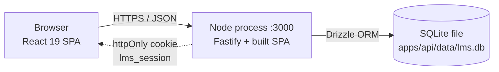
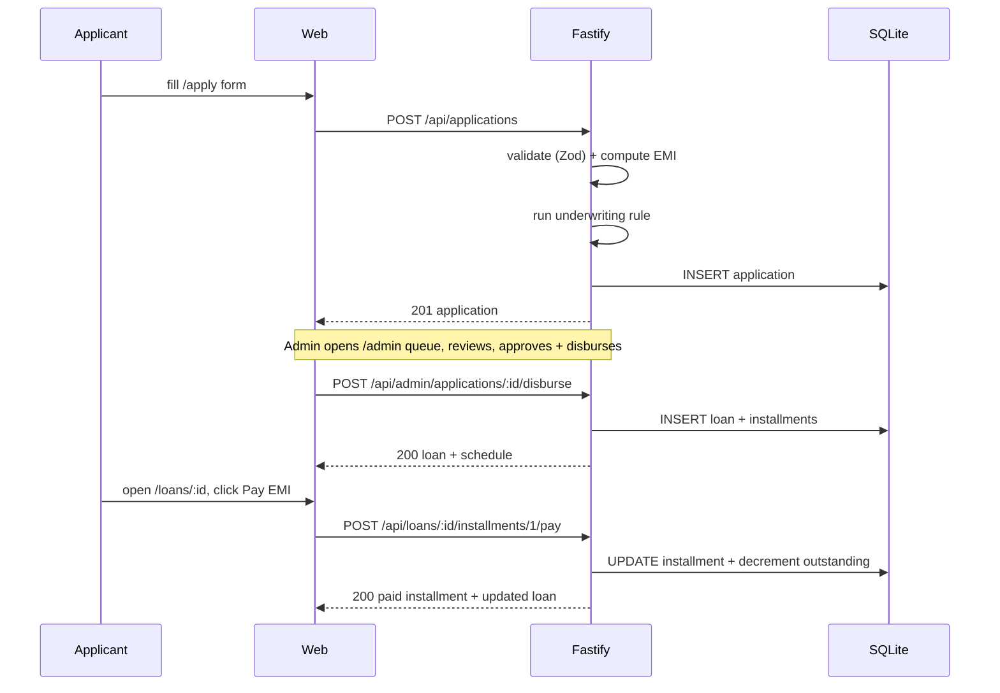
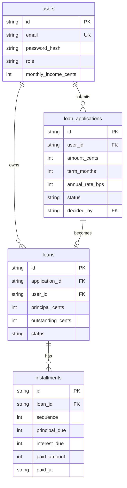

# High-Level Design — CREDENCE (LMS Prototype)

**Date:** 2026-08-05
**Companion:** [LLD](../lld/lld.md)

## 1. Purpose

A deployable prototype that demonstrates the full personal-loan lifecycle: application → automated underwriting → disbursement → amortization → EMI payment → balance decrement. Demoable from a single hosted URL in under two minutes using seed data that exercises both origination and mid-repayment flows.

## 2. Scope

**In scope**

- One loan product (fixed-rate personal loan, integer cents)
- Two roles: `applicant` and `admin`
- Email + password auth (JWT in httpOnly cookie)
- Rule-based underwriting (FOIR + income-multiple) with admin override
- Amortization schedule, installment payment, outstanding balance tracking
- Seeded admin and two applicants (one fresh, one mid-flight) for walkthrough

**Out of scope** — real KYC, credit bureau, document upload, email/SMS, late fees, prepayment, multi-product, multi-tenancy, audit log, PDF statements, real payments.

## 3. Architecture

One Node process owns the HTTP port, serves `/api/*` as JSON, and serves the built React bundle for everything else. There is no second service, no reverse proxy, no CORS.

**Why one process:** the brief calls for one live URL. Splitting API + static into two services would add CORS, two deploy targets, and two env surfaces for zero benefit at this scale.

## 4. Technology stack

| Layer | Choice | Rationale |
|---|---|---|
| Frontend | React 19, Vite, TypeScript, Tailwind, shadcn | Modern, typesafe, single component model |
| Routing | React Router 6 | Mature, shadcn examples assume it |
| Server state | TanStack Query | Cache + invalidation without Redux |
| Forms | react-hook-form + zodResolver | Uncontrolled, works with shared Zod schemas |
| Backend | Fastify, TypeScript, Node 20 LTS | Fast, typesafe, plugin model |
| Validation | Zod | One schema, two consumers (API + web) |
| ORM | Drizzle | Typesafe queries, plain SQL, easy migrations |
| Database | SQLite (better-sqlite3) | Zero-config, file-based, fine for one writer |
| Auth | @fastify/jwt + @fastify/cookie + bcrypt | httpOnly cookie, no CSRF for our routes |
| Workspace | pnpm workspaces | Single lockfile, no Turborepo overhead |
| Deploy | Render single Node service | Free tier, persistent disk |

## 5. Data flow — apply to first EMI

## 6. Data model

Four tables, foreign keys cascading on user delete.

Money is stored as `integer cents` everywhere — no floats. Dates are ISO 8601 strings.

## 7. Security

| Concern | Approach |
|---|---|
| Passwords | bcrypt cost 10 |
| Sessions | JWT in `httpOnly`, `SameSite=Lax` cookie (`lms_session`, 1h) + refresh token (`lms_refresh`, 30d) |
| CSRF | Not needed: cookie is SameSite=Lax, no state-changing GETs |
| XSS | React default escaping + shadcn primitives; no `dangerouslySetInnerHTML` |
| SQL injection | Drizzle parameterizes every query |
| Secrets | `JWT_SECRET` / `JWT_REFRESH_SECRET` / `DATABASE_URL` from env, never in repo |
| CORS | Not needed (same origin) |
| Rate limiting | Not implemented (Render edge handles DDoS) |
| Audit log | Not implemented (out of scope) |

## 8. Deployment

**Build:** `pnpm install --frozen-lockfile && pnpm build` → `apps/web/dist/` + `apps/api/dist/`.

**Start:** `pnpm start` runs `node apps/api/dist/server.js`. On boot, the server runs `migrate` then `seed` (idempotent upsert), so a cold start always ends with a usable DB.

**Render setup:** single Node service, free tier, persistent disk at `/data`. `DATABASE_URL=/data/lms.db`. Pushes to `main` auto-deploy.

**Env vars** (Render dashboard, mirrored in `.env.example`): `DATABASE_URL`, `JWT_SECRET`, `JWT_REFRESH_SECRET`, `NODE_ENV=production`, `PORT=10000`.

## 9. Observability

Out of scope. Render's request log dashboard is the prototype's only signal. No metrics, no tracing, no structured logging.

## 10. Future work

Anything in the spec's "out of scope" list: real KYC, real payments, document upload, multi-product, audit log, PDF statements, email notifications, late-fee calculation, prepayment, mobile polish.

---

**End of HLD.** For schemas, endpoints, and per-module detail see the [LLD](../lld/lld.md).