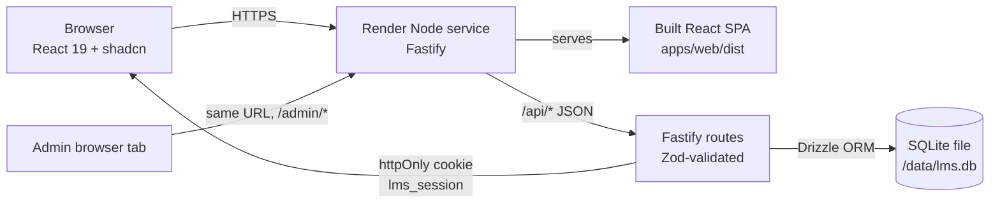
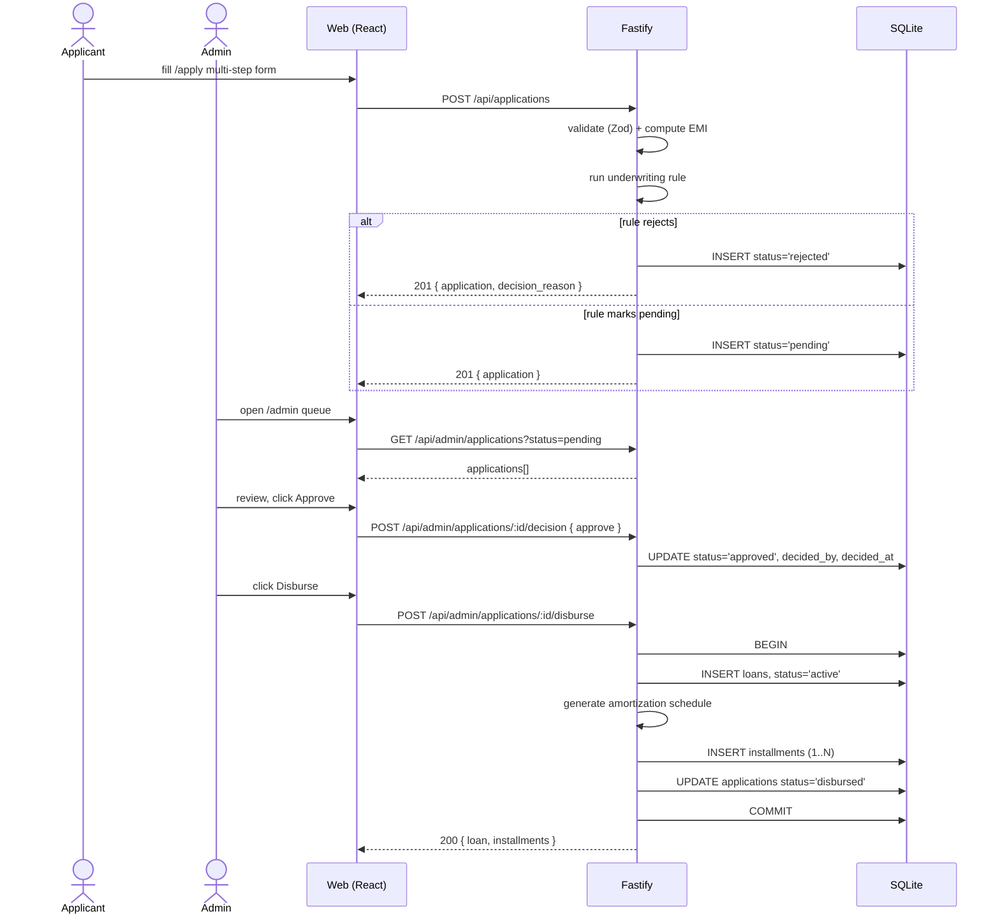
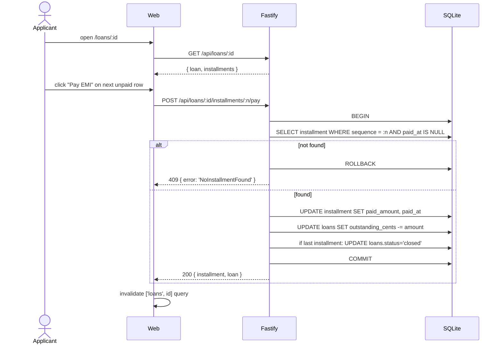
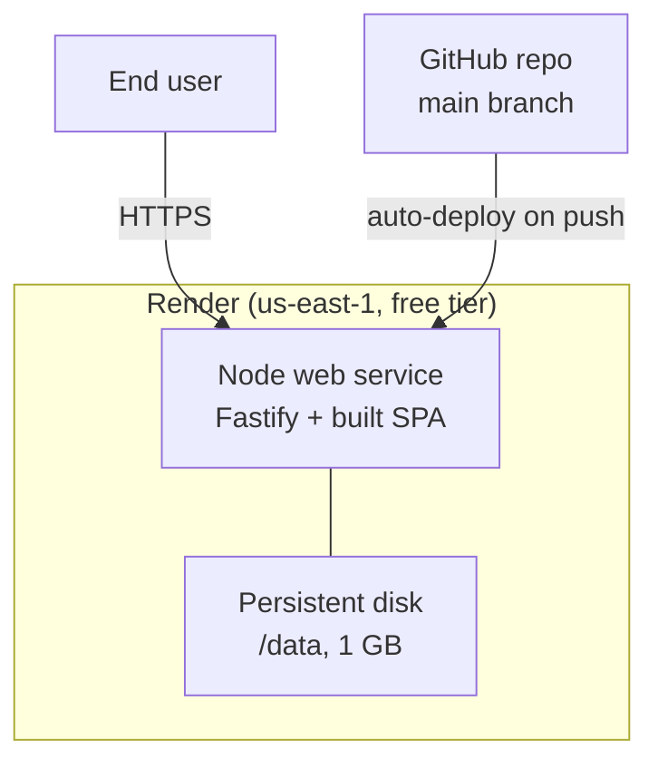

# LOS + LMS Prototype — High-Level Design (HLD)

**Date:** 2026-08-05
**Companion docs:** [Spec](../specs/2026-08-05-los-lms-prototype-design.md) · [LLD](../lld/2026-08-05-los-lms-prototype.md) · [Plan](../plans/2026-08-05-los-lms-prototype.md)

## 1. Purpose

Deliver a deployable prototype demonstrating the end-to-end personal-loan lifecycle: application → underwriting decision → disbursement → amortization schedule → installment payment → balance decrement. The prototype must be demoable against a single hosted URL in under two minutes, with seed data that exercises both origination and mid-repayment flows without manual setup.

## 2. Scope

**In scope (this prototype):**
- One loan product (fixed-rate personal loan)
- Two user roles: `applicant`, `admin`
- Email + password authentication (JWT in httpOnly cookie)
- Rule-based underwriting (FOIR + income-multiple) with admin override
- Amortization schedule generation, installment payment, outstanding balance tracking
- Seeded admin and two applicants (one fresh, one mid-flight) for walkthrough

**Out of scope (deferred):** real KYC, credit bureau, document upload, email/SMS, late fees, prepayment, multi-product, multi-tenancy, audit log, PDF statements, real payments. See spec §16.

## 3. System architecture

**Topology:** one Node process, one port (10000), one URL. Fastify serves `/api/*` from the same process that serves the built React bundle for every other path. There is no second service, no CORS, no reverse proxy. SQLite is a single file on a Render persistent disk.

**Process responsibilities:**
- **Fastify process** — HTTP server, JSON API, JWT verification, Zod validation, route handlers, Drizzle queries, domain logic (amortization, underwriting), static-file serving for the SPA.
- **SQLite file** — single source of truth. No replicas, no backups beyond Render's disk snapshots.
- **React SPA** — every screen, including `/admin/*`, runs in the same client. Role-based route guards determine what the user sees.

## 4. Technology stack

| Layer            | Choice                                      | Why                                                    |
|------------------|---------------------------------------------|--------------------------------------------------------|
| Frontend         | React 19, Vite, TypeScript, Tailwind, shadcn | Modern, typesafe, single component model               |
| Routing          | React Router 6                              | Mature, shadcn examples assume it                      |
| Server state     | TanStack Query                              | Cache + invalidation without Redux/Zustand             |
| Forms            | react-hook-form + zodResolver               | Uncontrolled, works with shared Zod schemas            |
| Backend          | Fastify, TypeScript, Node 20 LTS            | Fast, typesafe, plugin model                           |
| Validation       | Zod                                         | One schema, two consumers (API + web)                  |
| ORM              | Drizzle                                     | Typesafe queries, plain SQL, easy migrations           |
| Database         | SQLite (better-sqlite3)                     | Zero-config, file-based, fine for one writer           |
| Auth             | `@fastify/jwt` + `@fastify/cookie` + bcrypt  | httpOnly cookie, no CSRF for our routes                |
| Workspace        | pnpm workspaces                             | Single lockfile, no Turborepo overhead                 |
| Deploy           | Render single Node service                  | Free tier, persistent disk, single env                 |

## 5. Data flow

### 5.1 Apply → Underwrite → Disburse

### 5.2 Pay EMI

## 6. External integrations

**None.** This is a self-contained prototype. There are no third-party services — no payment processor, no email provider, no credit bureau, no KYC vendor, no analytics. The brief allows for a "live, interactive environment"; this design delivers that entirely on Render + a single SQLite file.

Future work (out of scope) would add: Stripe (payments), SendGrid (email), Plaid (bank linking), Onfido/Persona (KYC), Experian/Equifax (credit). The HLD does not plan for these.

## 7. Security

| Concern              | Approach                                              |
|----------------------|-------------------------------------------------------|
| Password storage     | bcrypt with cost factor 10                             |
| Auth tokens          | JWT in httpOnly + SameSite=Lax cookie (`lms_session`) |
| CSRF                 | Not needed: cookie is SameSite=Lax, no state-changing GETs |
| XSS                  | React's default escaping + shadcn primitives; no `dangerouslySetInnerHTML` |
| SQL injection        | Drizzle parameterizes all queries                      |
| Secrets              | `JWT_SECRET` and `DATABASE_URL` from env, never in repo |
| CORS                 | Not needed (same origin)                              |
| Rate limiting        | Not implemented (out of scope; Render edge handles DDoS) |
| Audit log            | Not implemented (out of scope)                        |

## 8. Deployment topology

- **Build:** `pnpm install --frozen-lockfile && pnpm build`. Produces `apps/web/dist` and `apps/api/dist`.
- **Start:** `pnpm start` runs `node apps/api/dist/server.js`. Before serving, the start script runs `migrate` then `seed` (idempotent upsert), so a cold start always ends with a usable DB.
- **Persistent disk:** mounted at `/data`, `DATABASE_URL=/data/lms.db`. Render's free tier provides 1 GB; the seed DB is < 100 KB.
- **Auto-deploy:** Render watches the GitHub repo's `main` branch. Push → build → deploy.
- **Env vars (set in Render dashboard, mirrored in `.env.example`):**
  - `DATABASE_URL` — path to the SQLite file
  - `JWT_SECRET` — random 64-char hex
  - `NODE_ENV=production`
  - `PORT=10000`
- **No CI.** Render handles build + deploy. Tests run locally before push.

## 9. Observability

Out of scope. The free Render service exposes request logs via the dashboard; no structured logging, no metrics, no tracing. The walkthrough video and `pnpm test` are the prototype's "is it working?" signals.

## 10. Future work (not built)

Anything in the spec's "out of scope" list is fair game for a v2: real KYC, real payments, document upload, multi-product, audit log, PDF statements, email notifications, late-fee calculation, prepayment, mobile-first polish.

---

**End of HLD.** For schemas, signatures, and per-module specs see the [LLD](../lld/2026-08-05-los-lms-prototype.md). For phased implementation see the [Plan](../plans/2026-08-05-los-lms-prototype.md).
