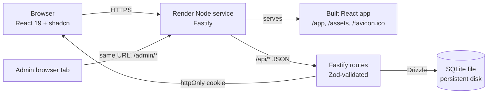

# LOS + LMS Prototype — Design

**Date:** 2026-08-05
**Status:** Approved (brainstorming)
**Scope:** Functional prototype covering one loan product end-to-end, deployable to Render, walkthrough-ready in <2 minutes.

## 1. Goal

Build a thin-slice, end-to-end Loan Origination System (LOS) and Loan Management System (LMS) demonstrating the full lending lifecycle: application → underwriting → disbursement → amortization → repayment.

Personal loan only, two roles (applicant, admin), single deployable Node service. No real KYC, no real credit bureau, no real payments.

## 2. Tech stack

| Layer       | Choice                                        |
|-------------|-----------------------------------------------|
| Frontend    | React 19, Vite, TypeScript, Tailwind, shadcn/ui |
| Routing     | React Router 6                                |
| Server state| TanStack Query                                |
| Forms       | react-hook-form + zodResolver                 |
| Backend     | Fastify, TypeScript                           |
| Validation  | Zod (shared with frontend)                    |
| ORM         | Drizzle                                       |
| Database    | SQLite (file on persistent disk)              |
| Auth        | JWT in httpOnly cookie, bcrypt password hash  |
| Workspace   | pnpm workspaces                               |
| Deploy      | Render single Node service                    |

## 3. Architecture



One Node process, one port, one URL. Fastify mounts `/api/*` and falls through to the built React bundle for everything else. SQLite file lives on a Render persistent disk; the path comes from `DATABASE_URL`. No CORS, no second service, no env duplication.

## 4. Repository layout

```
practice/lms/
├─ pnpm-workspace.yaml
├─ package.json                # root scripts: dev, build, seed, test, start
├─ tsconfig.base.json
├─ .env.example
├─ .gitignore
├─ README.md
├─ apps/
│  ├─ api/                     # Fastify + Drizzle + Zod + JWT
│  │  ├─ src/
│  │  │  ├─ server.ts          # entry: builds app, listens
│  │  │  ├─ app.ts             # Fastify factory, plugins, routes
│  │  │  ├─ db/
│  │  │  │  ├─ client.ts       # better-sqlite3 + drizzle init
│  │  │  │  ├─ schema.ts       # users, loan_applications, loans, installments
│  │  │  │  ├─ migrate.ts      # apply migrations
│  │  │  │  └─ seed.ts         # seed users + one mid-flight loan
│  │  │  ├─ domain/
│  │  │  │  ├─ amortization.ts # EMI math, schedule generation
│  │  │  │  └─ underwriting.ts # rule engine (income/FOIR)
│  │  │  ├─ routes/
│  │  │  │  ├─ auth.ts         # POST /signup, /login, /logout, GET /me
│  │  │  │  ├─ applications.ts # POST /applications, GET /applications, GET /applications/:id
│  │  │  │  ├─ loans.ts        # GET /loans, GET /loans/:id, POST /loans/:id/installments/:n/pay
│  │  │  │  └─ admin.ts        # GET /admin/applications, POST /admin/applications/:id/decision, POST /admin/loans/:id/disburse
│  │  │  └─ lib/
│  │  │     ├─ auth.ts         # JWT sign/verify, password hash, cookie helpers
│  │  │     ├─ errors.ts       # typed domain errors + mapper
│  │  │     └─ money.ts        # integer-cents helpers (Math.round half-up)
│  │  └─ test/                 # node:test + tsx loader
│  └─ web/                     # Vite + React 19 + shadcn
│     ├─ src/
│     │  ├─ main.tsx
│     │  ├─ App.tsx            # router outlet
│     │  ├─ routes/
│     │  │  ├─ landing.tsx
│     │  │  ├─ login.tsx
│     │  │  ├─ signup.tsx
│     │  │  ├─ apply.tsx       # multi-step form
│     │  │  ├─ dashboard.tsx   # applicant's loans + next EMI
│     │  │  ├─ loan-detail.tsx # schedule, pay EMI button
│     │  │  └─ admin/
│     │  │     ├─ queue.tsx
│     │  │     └─ application-detail.tsx
│     │  ├─ components/        # shadcn wrappers + feature components
│     │  ├─ lib/
│     │  │  ├─ api.ts          # fetch wrapper, cookie-based auth
│     │  │  └─ format.ts       # money + date formatting
│     │  └─ hooks/             # TanStack Query hooks
│     └─ index.html
└─ packages/
   └─ shared/                  # shared Zod schemas + TS types
      └─ src/index.ts          # LoanStatus, ApplicationInput, DTOs
```

**Top-level scripts (root `package.json`):**

- `pnpm dev` — runs API (tsx watch) and web (vite) concurrently
- `pnpm build` — builds web, then API bundles for prod
- `pnpm seed` — applies migrations + seeds two users + one mid-flight loan
- `pnpm test` — runs API tests under `node --test`
- `pnpm start` — runs the prod API which also serves the built web

## 5. Data model

All money stored as integer cents. All timestamps stored as ISO 8601 strings. IDs are nanoid.

```
users
  id              text  pk
  email           text  unique not null
  password_hash   text  not null
  full_name       text  not null
  role            text  not null  -- 'applicant' | 'admin'
  monthly_income  int   not null  -- cents
  created_at      text  not null

loan_applications
  id              text  pk
  user_id         text  fk users.id
  amount_cents    int   not null
  term_months     int   not null           -- 6, 12, 24, 36
  annual_rate_bps int   not null           -- basis points; 1500 = 15.00%
  purpose         text  not null
  employment      text  not null           -- 'salaried' | 'self_employed'
  status          text  not null           -- 'pending' | 'approved' | 'rejected' | 'disbursed'
  decision_reason text
  decided_by      text  fk users.id
  decided_at      text
  disbursed_at    text
  created_at      text  not null

loans                           -- exists only after disbursement
  id              text  pk  -- equal to the originating loan_applications.id
  application_id  text  fk loan_applications.id  unique  -- 1:1; id == application_id
  user_id         text  fk users.id
  principal_cents int   not null
  annual_rate_bps int   not null
  term_months     int   not null
  start_date      text  not null           -- ISO date
  end_date        text  not null
  status          text  not null           -- 'active' | 'closed'
  outstanding_cents int not null

installments
  id              text  pk
  loan_id         text  fk loans.id
  sequence        int   not null           -- 1..N
  due_date        text  not null
  principal_due   int   not null
  interest_due    int   not null
  paid_amount     int   not null default 0
  paid_at         text
  unique (loan_id, sequence)
```

## 6. State machine

```
            apply
   (none) ────────►  pending
                       │
            admin_approve    admin_reject
              │                      │
              ▼                      ▼
          approved               rejected (terminal)
              │
        admin_disburse
              │
              ▼
          disbursed
              │
          (loan row created, schedule generated, status='active')
              │
        final installment paid
              │
              ▼
           closed
```

Transitions enforced server-side in `routes/admin.ts`. `pending → approved` and `pending → rejected` are mutually exclusive and require `decided_by` and `decided_at`. `approved → disbursed` creates the `loans` row and the full installments schedule in a single transaction.

## 7. Underwriting rule

Computed at application submission and surfaced as the rule recommendation in the admin queue.

- Compute EMI from `amount_cents`, `annual_rate_bps`, `term_months` using the standard reducing-balance formula.
- `foir = emi / monthly_income_cents`.
- Reject if `foir > 0.50` → reason `"EMI exceeds 50% of income"`.
- Reject if `monthly_income_cents < 3 * emi` → reason `"Income insufficient for requested EMI"`.
- Otherwise mark `pending` and let the admin decide. The rule's recommendation is shown next to the admin's decision so the demo illustrates the difference.

The rule is advisory, not authoritative — the admin can override in either direction (with a reason).

## 8. Amortization

Standard reducing-balance EMI. For a loan with principal `P`, monthly rate `r = annual_rate_bps / 10000 / 12`, and `n` months:

```
emi = P * r * (1 + r)^n / ((1 + r)^n - 1)
```

Computed entirely in integer cents with `Math.round` half-up applied to EMI and each installment. The final installment absorbs any rounding remainder so the schedule sums exactly to `P`. The schedule is generated once at disbursement and stored in `installments`. No recomputation on payment — payment just marks the next unpaid row paid and decrements `loans.outstanding_cents`.

## 9. API surface

All routes return JSON. Auth via httpOnly cookie `lms_session` (JWT). `401` when missing/invalid, `403` when role doesn't match.

```
POST   /api/auth/signup           { email, password, fullName, monthlyIncome }
                                 -> 201 { user }, sets cookie
POST   /api/auth/login            { email, password }
                                 -> 200 { user }, sets cookie
POST   /api/auth/logout           -> 204, clears cookie
GET    /api/auth/me               -> 200 { user } | 401

POST   /api/applications          { amount, termMonths, annualRateBps, purpose, employment }
                                 -> 201 { application }
GET    /api/applications          -> 200 { applications: [...] }   (current user only)
GET    /api/applications/:id      -> 200 { application }            (owner or admin)

GET    /api/loans                 -> 200 { loans: [...] }            (current user; admin sees all)
GET    /api/loans/:id             -> 200 { loan, installments: [...] } (owner or admin)
POST   /api/loans/:id/installments/:n/pay
                                 -> 200 { installment, loan }       (mock: marks paid)

GET    /api/admin/applications?status=pending
                                 -> 200 { applications: [...] }    (admin only)
POST   /api/admin/applications/:id/decision
                                 { decision: 'approve' | 'reject', reason? }
                                 -> 200 { application }            (admin only)
POST   /api/admin/applications/:id/disburse
                                 -> 200 { loan }                   (admin only; creates loan + schedule)

```

**Zod schemas** for every request body and response live in `packages/shared/src/index.ts` and are imported by both API (request validation) and web (form validation via `react-hook-form`'s zod resolver). One source of truth.

## 10. Frontend pages

```
/                      Landing (hero + login/signup CTAs)
/login                 Email + password
/signup                Email + password + full name + monthly income
/apply                 Multi-step form (shadcn Form + Stepper):
                         1. Loan details (amount, term, rate read-only preview)
                         2. Purpose + employment
                         3. Review + submit
/dashboard             Applicant home: list of applications + active loans + next-EMI card
/loans/:id             Loan detail: schedule table, "Pay EMI" button on next unpaid row,
                       outstanding balance, paid/remaining totals
/admin                 Admin queue (only if role==='admin'): pending applications table
/admin/applications/:id  Per-application: applicant details, rule recommendation,
                       approve/reject form, (if approved) Disburse button
```

- **Routing:** React Router 6. Protected routes redirect to `/login` if no session. `/admin/*` redirects to `/dashboard` if `user.role !== 'admin'`.
- **Server state:** TanStack Query. Keys: `['me']`, `['applications']`, `['loans']`, `['loans', id]`, `['admin','applications', status]`. Mutations invalidate the relevant keys.
- **Forms:** react-hook-form + zodResolver, one schema per route imported from `@lms/shared`.
- **shadcn components used:** Button, Input, Form, Card, Table, Dialog, Toast (sonner), Badge (for status), Select, Tabs, Skeleton.
- **No global state library.** Auth lives in the `['me']` query.

## 11. Money & formatting

- **API boundary:** integer cents only. No floats cross the wire.
- **Server domain:** integer arithmetic, `Math.round` for rounding.
- **Client display:** `Intl.NumberFormat` with `style: 'currency'`, `currency: 'INR'`, dividing cents by 100.
- **Dates:** ISO 8601 strings on the wire; `Intl.DateTimeFormat` on display.

## 12. Error handling

**API**
- Fastify error handler maps Zod errors to `400 { error: 'validation', issues: [...] }`, auth failures to `401`, role mismatches to `403`, unknown to `500 { error: 'internal' }`.
- Domain errors (`LoanAlreadyClosed`, `NoInstallmentFound`, `InvalidStateTransition`) throw typed errors caught by `lib/errors.ts` mapper → `409 { error, message }`.

**Web**
- TanStack Query `onError` → sonner toast.
- Forms show field-level errors from Zod via react-hook-form.
- Single `<Toaster />` at the app root.

No retries, no global error boundary, no silent failures.

## 13. Testing

`node --test` with `tsx` loader. No test framework.

- **Pure functions:** `amortization.test.ts` (schedule sums to principal, last installment absorbs rounding), `underwriting.test.ts` (FOIR boundary cases, recommendation matches rule).
- **Integration:** boot the Fastify app in-process against an in-memory SQLite (`':memory:'`), no network. Seed file skipped.
  - `auth.test.ts` — signup → login → me
  - `applications.test.ts` — apply → admin approve → disburse → schedule generated
  - `payment.test.ts` — pay installment → outstanding decrements
- **Web:** no tests. Surface is thin; API integration tests cover the meaningful behavior. UI smoke is the walkthrough video.

## 14. Deployment (Render)

- One Node web service.
- Build command: `pnpm install --frozen-lockfile && pnpm build`.
- Start command: `pnpm start` — runs the prod API which also serves the built web from `apps/web/dist`.
- Persistent disk mounted at `/data`. `DATABASE_URL=/data/lms.db`.
- `start` wrapper applies migrations then seeds (idempotent upsert) before launching the server.
- Env vars: `DATABASE_URL`, `JWT_SECRET`, `NODE_ENV=production`, `PORT=10000`. `.env.example` documents all four.
- README documents: prerequisites, `pnpm i`, `pnpm dev`, `pnpm seed`, `pnpm test`, deploy-to-Render steps, screenshots of each major screen.

## 15. Seed data

1. **Admin:** `admin@lms.dev` / `admin123` — role `admin`, monthly income 0.
2. **Applicant A — fresh:** `alice@lms.dev` / `alice123` — role `applicant`, monthly income 5,000,000 cents (₹50,000), no applications, no loans. Used in the walkthrough to demo the apply → approve → disburse path.
3. **Applicant B — mid-flight:** `bob@lms.dev` / `bob123` — role `applicant`, monthly income 10,000,000 cents (₹100,000), one approved+disbursed loan (5,000,000 cents = ₹50,000, 12 months, 15% APR) that started 3 months ago, with 3 installments already paid and 9 remaining. Used to demo the schedule, "Pay EMI" button, and outstanding balance without first running through origination.

Seed is idempotent — running `pnpm seed` twice produces the same state.

## 16. Out of scope (explicit YAGNI)

The following are deliberately excluded from the prototype. The HLD/LLD will note them as future work but not implement them.

- Real KYC / credit bureau integration
- Document upload
- Email / SMS notifications
- Late fees, dunning letters, collections workflow (overdue rows show a red badge, nothing more)
- Prepayment, partial payment
- Multi-loan-product support (one product: fixed-rate personal loan)
- Multi-tenancy, audit log, RBAC beyond applicant/admin
- Statement PDF generation
- Mobile-responsive polish beyond Tailwind defaults
- Real payment processing (Stripe, etc.) — payment is a mocked "Pay EMI" button

## 17. Acceptance criteria

A reviewer should be able to, in under two minutes, walk through:

1. Open the deployed URL, sign up as a new applicant, submit a loan application.
2. Open a second tab, log in as the admin, see the pending application, read the rule recommendation, approve it, disburse it.
3. Switch back to the applicant tab, see the loan with a generated schedule.
4. Click "Pay EMI" on the next due installment, see outstanding balance decrement, see the row marked paid.
5. Log in as the seeded `bob@lms.dev` to see a mid-flight loan immediately, with mixed paid/unpaid installments.

All five steps must work end-to-end against the deployed Render URL with no manual DB intervention.
